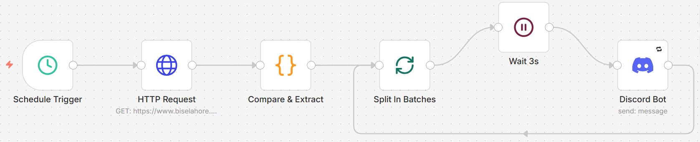
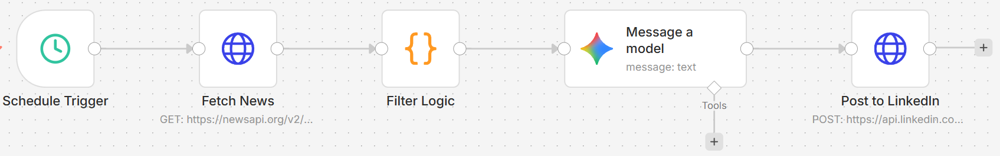

#  n8n Automation Workflows Showcase

[](https://n8n.io/)
[](https://developer.mozilla.org/en-US/docs/Web/JavaScript)
[](https://en.wikipedia.org/wiki/Comma-separated_values)
[](LICENSE)


Welcome to my **n8n Automation Workflows Showcase** — a curated collection of automation workflows demonstrating my skills in web scraping, workflow automation, data extraction, and productivity solutions.

> ⚠️ **Note:** This is a public demo version. Full workflows are private and available upon request.

---

## 📑 Table of Contents

- [Current Workflows](#current-workflows)
  - [Web Scraping: Link Extractor](#1️⃣-web-scraping-link-extractor)
  - [Website Monitoring: Lahore Board Update Monitor](#2️⃣-website-monitoring-lahore-board-update-monitor)
  - [AI-Powered LinkedIn Content Bot ](#3%EF%B8%8F%E2%80%A3-ai-powered-linkedin-content-bot-featured-)
- [Future Workflows](#-future-workflows)
- [How to Use](#️-how-to-use)
- [Key Takeaways](#-key-takeaways)
- [Author](#author)
- [License](#license)
---


## Current Workflows

### 1️⃣ Web Scraping: Link Extractor

This workflow automatically extracts **useful links from any webpage**, filters out social media links, JavaScript placeholders, and duplicate URLs, and exports a **clean CSV output**.

**Demo Screenshot:**


**Sample Output CSV:** [Download CSV](web-scraping/sample-output.csv.txt)

**Partial Demo JSON:**

```json
{
  "nodes": [
    {
      "name": "Manual Trigger: Demo",
      "type": "n8n-nodes-base.manualTrigger"
    },
    {
      "name": "HTTP Request: Demo",
      "type": "n8n-nodes-base.httpRequest"
    }
  ]
}
```

**Skills Highlighted:** `n8n`, `JavaScript`, `HTTP Requests`, `Data Automation`

---
### 2️⃣ Website Monitoring: Lahore Board Update Monitor

This workflow automatically monitors the **BISE Lahore website** for new updates such as results, date sheets, or exam announcements.  
It performs **scheduled checks**, detects newly published links, and sends a notification when new updates appear.

**Demo Screenshot:**  


**Sample Output:**   [Download Image](LahoreBoard-Website-Monitor/sample_output.png)

**Partial Demo JSON:**

```json

{
  "nodes": [
    {
      "name": "Schedule Trigger",
      "type": "n8n-nodes-base.scheduleTrigger"
    },
    {
      "name": "HTTP Request",
      "type": "n8n-nodes-base.httpRequest"
    },
    {
      "name": "Compare & Extract",
      "type": "n8n-nodes-base.code"
    },
    {
      "name": "Discord Bot",
      "type": "n8n-nodes-base.discord"
    }
  ]
}
```

**Skills Highlighted:** `n8n`, `JavaScript`, `Web Monitoring`, `Automation`, `Change Detection`

---

### 3️⃣ AI-Powered LinkedIn Content Bot 
This advanced workflow automates personal branding by fetching trending tech news and transforming it into engaging LinkedIn posts using AI. It ensures consistency without manual effort.

**Demo Screenshot:**  


**Sample Output:**   [View Image](LinkedIn-AI-Automation/sample-output.png)


**How it works:**
1. **Scheduled Trigger:** Runs automatically on Monday & Thursday at 4:00 PM.
2. **News Fetching:** Connects to News API for real-time technology trends.
3. **JS Logic:** Filters articles to ensure high-quality and unique content selection.
4. **AI Generation:** Google Gemini generates human-like posts with hooks, bullets, and hashtags.
5. **Auto-Publish:** Publishes directly to LinkedIn via API.

**𝗥𝗲𝗮𝗹-𝗪𝗼𝗿𝗹𝗱 𝗨𝘀𝗲 𝗖𝗮𝘀𝗲𝘀:**

This type of automation can be used for:

- Personal branding (consistent posting)

- News summarization

- Content marketing automation

- AI-powered social media management


**Partial Demo JSON:**

```json
{
  "nodes": [
    {
      "name": "Schedule Trigger",
      "type": "n8n-nodes-base.scheduleTrigger",
      "parameters": {
        "rule": {
          "interval": [
            { "field": "cronExpression", "expression": "0 16 * * 1,4" }
          ]
        }
      }
    },
    {
      "name": "Fetch News",
      "type": "n8n-nodes-base.httpRequest",
      "parameters": {
        "url": "https://newsapi.org/v2/top-headlines",
        "method": "GET"
      }
    },
    {
      "name": "Gemini AI: Content Gen",
      "type": "n8n-nodes-base.googleGemini",
      "parameters": {
        "prompt": "Write a professional LinkedIn post about..."
      }
    },
    {
      "name": "LinkedIn API: Post",
      "type": "n8n-nodes-base.httpRequest",
      "parameters": {
        "url": "https://api.linkedin.com/v2/ugcPosts",
        "method": "POST"
      }
    }
  ]
}
```

**Skills Highlighted:** n8n, LinkedIn API, News API, Google Gemini (AI), JavaScript, Content Strategy.

---

###  Future Workflows

* Lead generation from business directories
* Data cleaning & transformation pipelines
* Government portal automation

> Each new workflow will be added to this repo in the same structured format.

---

### ⚙️ How to Use

1. View **workflow screenshots** and **demo GIFs**.
2. Download **sample output** files to see output examples.
3. Request full workflow JSON files if needed for collaboration or demonstration.

---

### 💡 Key Takeaways

* Automates repetitive tasks to **save time & improve efficiency**
* Generates structured, usable outputs from raw data
* Demonstrates professional workflow design & automation expertise
* Portfolio-ready showcase for freelance clients and recruiters

---

### Contribution

Liked this Repo? **Star ⭐ it**. 


### Author
**Maheen Fatima**  
- [LinkedIn](https://www.linkedin.com/in/maheenfatimaa)
- [View my Upwork Profile](https://www.upwork.com/freelancers/~017a150168182cf524?mp_source=share)


### License

This project is licensed under the MIT License.

---


