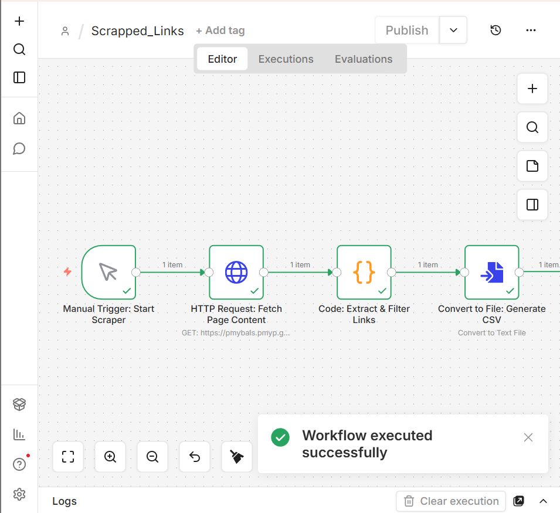

# 🚀 n8n Automation Workflows Showcase

[](https://github.com/your-username/n8n-workflow-showcase)
[](https://github.com/your-username/n8n-workflow-showcase)
[](LICENSE)

Welcome to my **n8n Automation Workflows Showcase** — a curated collection of automation workflows demonstrating my skills in web scraping, workflow automation, data extraction, and productivity solutions.

> ⚠️ **Note:** This is a public demo version. Full workflows are private and available upon request.

---

## Current Workflows

### 1️⃣ Web Scraping: Link Extractor

This workflow automatically extracts **useful links from any webpage**, filters out social media links, JavaScript placeholders, and duplicate URLs, and exports a **clean CSV output**.

**Demo Screenshot:**


**Sample Output CSV:**
[Download CSV](web-scraping/sample-output.csv)

**Partial Demo JSON:**

```json
{
  "nodes": [
    {
      "name": "Manual Trigger: Demo",
      "type": "n8n-nodes-base.manualTrigger"
    },
    {
      "name": "HTTP Request: Demo",
      "type": "n8n-nodes-base.httpRequest"
    }
  ]
}
```

**Skills Highlighted:** `n8n`, `JavaScript`, `HTTP Requests`, `Data Automation`

---

### 2️⃣ Future Workflows

* Lead generation from business directories
* Data cleaning & transformation pipelines
* Government portal automation

> Each new workflow will be added to this repo in the same structured format.

---

### ⚙️ How to Use

1. View **workflow screenshots** and **demo GIFs**.
2. Download **sample CSV** files to see output examples.
3. Request full workflow JSON files if needed for collaboration or demonstration.

---

### 💡 Key Takeaways

* Automates repetitive tasks to **save time & improve efficiency**
* Generates structured, usable outputs from raw data
* Demonstrates professional workflow design & automation expertise
* Portfolio-ready showcase for freelance clients and recruiters

---

### Contribution

If this repository helps you, feel free to **star ⭐ it**. 


### Author
**Maheen Fatima**  
- [LinkedIn](https://www.linkedin.com/in/maheenfatimaa)
- [View my Upwork Profile](https://www.upwork.com/freelancers/~017a150168182cf524?mp_source=share)


### License

This project is licensed under the MIT License.

---


